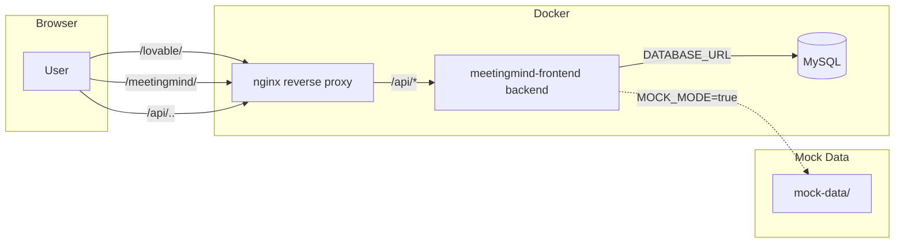

## Integration: lovable + MeetingMind AI

This document describes how the `meetingmind-ai-final` project is integrated into the `meeting-mind-ai-uk` repository and how to run the combined stack.

### Folder layout

- `./` — lovable landing page (Vite React app)
- `./meetingmind-ai-final/meetingmind-frontend` — MeetingMind full-stack app (Vite React client + Express/tRPC backend)
- `./infra/nginx` — NGINX reverse proxy and static hosting
- `./mock-data/` — Deterministic mock data for testing and demos
- `./scripts` — Helper scripts for build, dev, seed, and verification

### Routing

- `http://localhost:8080/lovable/` → lovable landing page (root app build)
- `http://localhost:8080/meetingmind/` → MeetingMind landing page (static build from `meetingmind-frontend`)
- `http://localhost:8080/api/` → proxied to MeetingMind backend (`meetingmind-backend` container on port 3000)
- `http://localhost:8080/api/health` → health check endpoint

### Quick start

1. Copy env file:

   ```bash
   cp .env.example .env
   # Edit .env to set real secrets (or leave MOCK_MODE=true for testing)
   ```

2. Check setup:

   ```bash
   ./scripts/check-setup.sh
   ```

3. Build all artifacts:

   ```bash
   ./scripts/build-all.sh
   ```

4. Start Docker stack:

   ```bash
   ./scripts/dev-up.sh
   ```

5. Seed mock data:

   ```bash
   node scripts/seed-mock-data.js
   ```

6. Verify:

   ```bash
   ./scripts/smoke.sh
   # Then open:
   # - http://localhost:8080/lovable/
   # - http://localhost:8080/meetingmind/
   ```

### Mock mode

Set `MOCK_MODE=true` in `.env` to use deterministic mock responses instead of calling external AI APIs. This is useful for:
- Local development without API keys
- CI/CD pipelines
- Demos with predictable outputs

Set `VITE_USE_MOCK=true` for the frontend to use client-side mock data.

### Mock data structure

```
mock-data/
├── meetings/          # Meeting metadata JSON files
├── transcripts/       # Raw transcript text files
├── summaries/         # AI-generated summary JSON files
├── actions/           # Extracted action items JSON files
├── anchors/           # Blockchain anchor metadata
├── nft/               # NFT token metadata (ERC-721 tokenURI format)
├── embeddings/        # Placeholder embedding vectors
├── events/            # Agent events and on-chain event logs
├── wallets/           # Synthetic test accounts (dev only)
├── proofs/            # Merkle proof test vectors
├── failure_scenarios/ # Error/edge case test data
├── api_responses/     # Example API response payloads
└── seed-script-config.json
```

### Available scripts

| Script | Purpose |
|--------|---------|
| `scripts/build-all.sh` | Build both frontends |
| `scripts/dev-up.sh` | Start Docker Compose stack |
| `scripts/smoke.sh` | Run integration smoke tests |
| `scripts/check-setup.sh` | Verify project configuration |
| `scripts/seed-mock-data.js` | Seed database with mock data |
| `scripts/collect-logs.sh` | Gather container logs for debugging |

### Mermaid network diagram



### Debugging

See [docs/debugging.md](debugging.md) for common errors and troubleshooting steps.
